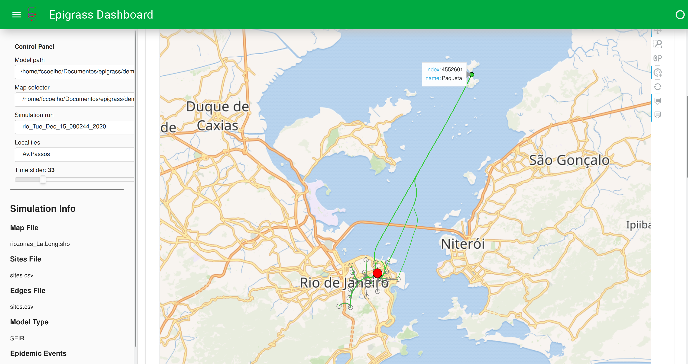

# Epigrass
## Epidemiological Geo-referenced Analysis and Simulation system

Epigrass is a Python Library aimed at making the simulation of metapopulation models as easy as possible.
Documentation is available [here](https://epigrass.readthedocs.io/en/latest/).

## Installation
You can install Epigrass directly from PyPi, the Python Package Index.
For mode details, check the [docs](https://epigrass.readthedocs.io/en/latest/install.html#)

## Getting Started

Folow [these instructions](https://epigrass.readthedocs.io/en/latest/using.html).
